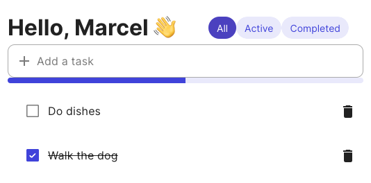
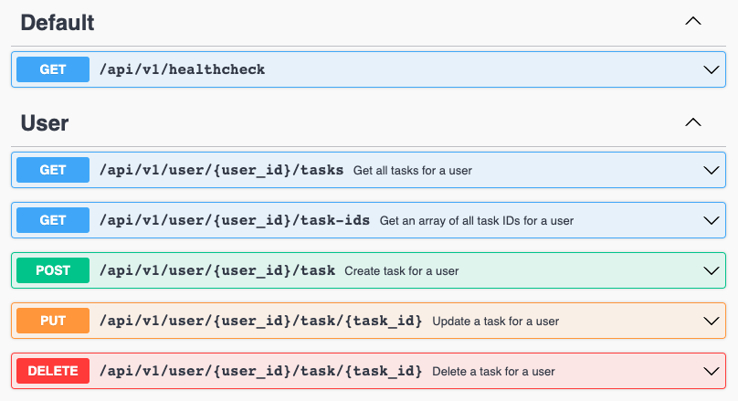

# To-Do List Application

This is a prototype for a to-do list application developed as part of a take-home assignment. It consists of a frontend and a backend. The backend is developed using TypeScript, Node.js, and Express, while the frontend is built with Vue 3 and Vuetify 3 and is based on the Nuxt 3 project starter template found at https://github.com/BayBreezy/nuxt3-vuetify3-starter.

## Preview



## Getting Started

### Prerequisites

Before getting started, make sure you have the following software installed on your system:

- Running Docker Daemon
- Docker Compose

You will also need to create a `.env` file in the project root directory. You can use the provided `example.env` file as a template.

## Fast start

```sh
docker-compose up --build -d
```

## Documentation

Swagger documentation will be avilable at: http://localhost:{API_PORT}/docs


